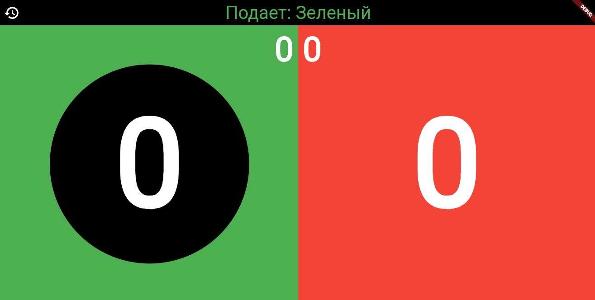

# Tennis32

## Цифровое табло для счёта теннисного матча

 Написано на фреймворке Flutter

**Основные возможности программы:**
1. Отображение счёта матча
2. Отображение подачи 
    - подача меняется каждые 2 очка
    - при достижении 10 очков любым игроком, подача меняется каждый ход
3. Отображение победиля
4. Смена сторон игроков, при завершении матча
5. Ввод пользовательских фамилий для отображения

## Скриншоты

### Ввод пользовательских имён

-
### Выбор подающего игрока

-
### Отображение счета и подачи

-
### Подача перешла красному игроку

-
### Победный экран

-

